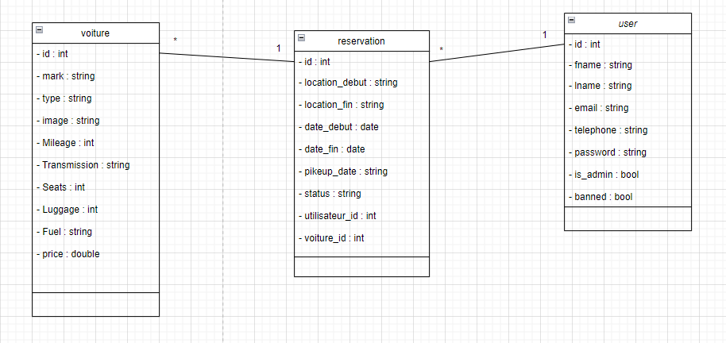
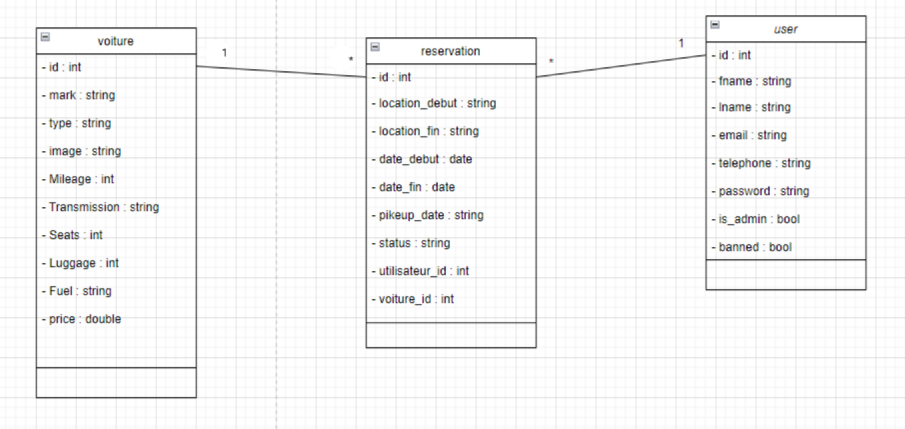

# Renting Cars Web Site
This is a web site for renting cars. The site has both a client side and an admin side. 
The client side is where users can browse available cars, make reservations, and view their account information. 
The admin side is where site administrators can manage cars, reservations, and user accounts.

# Client Side Features

User registration and login: Clients can sign up for a new account on the site, or log in if they already have an account. This feature will allow users to save their reservations and preferences.

Search by dates and location: Clients can search for available cars based on their desired pick-up and return dates and location. This feature will allow clients to easily find cars that meet their needs.

View car details: Clients can view detailed information about each car, including its make, model, features, and availability. This feature will help clients make informed decisions when choosing a car to rent.

Make a reservation: Clients can reserve a car by selecting their desired pick-up and return dates and location. This feature will allow clients to lock in their rental and ensure that the car is available when they need it.

Modify user profile: Clients can modify their user profile information, such as their name, email, and password. This feature will allow clients to keep their account information up-to-date.

View and manage reservations: Clients can view a list of their reservations and modify or cancel them if needed. This feature will allow clients to keep track of their rental history and make changes as necessary.

Log out: Clients can log out of their account when they are finished using the site. This feature will help ensure the security of their account information.
# Video Demonstration
<video width="320" height="240" controls>
  <source src="./git-images/v1.mp4" type="video/mp4">
  Your browser does not support the video tag.
</video>

# Admin Side Features
Dashboard with charts: The admin side will have a dashboard with charts and graphs to display important metrics, such as the number of reservations, revenue, and user activity. This feature will help the admin team get a quick overview of the site's performance.

User login/logout: Admins can log in to the admin side with their username and password, and log out when they are finished using the site. This feature will ensure that only authorized users can access the admin side.

Modify admin profile: Admins can modify their own profile information, such as their name, email, and password. This feature will allow admins to keep their account information up-to-date.

Ban/unban a user: Admins can ban or unban a user if necessary. This feature will help the admin team maintain the integrity of the site and prevent abusive or fraudulent behavior.

View user list: Admins can view a list of all registered users on the site, including their contact information and account status. This feature will help the admin team manage user accounts and respond to user inquiries.

View cars list: Admins can view a list of all cars available for rent, including their make, model, and availability status. This feature will help the admin team manage the site's inventory and ensure that all cars are in good condition.

View orders list: Admins can view a list of all reservations made by clients, including the client's name, the car rented, and the reservation status. This feature will help the admin team keep track of rental history and ensure that all reservations are properly managed.

Change order status: Admins can change the status of a reservation from pending to approved or rejected, based on the availability of the car and other factors. This feature will help ensure that clients receive timely responses to their reservation requests.

Update a car: Admins can update the details of a car, such as its make, model, features, and availability. This feature will allow the admin team to keep the site's inventory up-to-date.

Delete a car: Admins can delete a car from the site if necessary, such as if the car is no longer available or in poor condition. This feature will help ensure that clients only see cars that are currently available for rent.
 
 # Video Demonstration
<video width="320" height="240" controls>
  <source src="git-images/v1.mp4" type="video/mp4">
  Your browser does not support the video tag.
</video>

# Technologies Used

HTML

CSS

JavaScript

Bootstrap

Django

MySQL

Selenium

# Class diagram



# Database cars:
Database cars
We have scraped data from the car rental website https://www.discovercars.com/fr using Python and Selenium. The data has been saved as a JSON file. We then used this JSON data to populate our MySQL database with car information.

The car data includes the car name, number of seats, number of luggage, number of doors, whether the car is air-conditioned or manual, and the price. We have created a Django model for the car object and used Django's built-in ORM to create and manipulate data in our MySQL database.

With the car data now stored in our database, users can search for cars based on location and dates, and reserve a car for their desired time period. Admins can manage the car inventory by adding, updating, and deleting car information as needed.

```python
import json

from selenium import webdriver
from selenium.webdriver.common.by import By
options = webdriver.ChromeOptions()
options.add_experimental_option("detach", True)
website = 'https://www.discovercars.com/fr/search/b8550f2d-18a4-4825-980f-1c1d4bfe7b54'
path = 'Users/Yagami/Downloads/Chromedriver'
driver = webdriver.Chrome(options=options,executable_path=path)
driver.get(website)
all_matches_button = driver.find_element(By.XPATH, "//a[@class='button button-block show-more-cars trigger-gtm-sr']")
all_matches_button.click()
all_matches_button.click()
all_matches_button.click()
try:
    cars=driver.find_elements(By.XPATH,"//div[@class='car-box']")
except:
    cars = driver.find_elements(By.XPATH, "//div[@class='car-box no-show']")
data = []
data2 = []
for car in cars:
    try:
        image=car.find_element(By.XPATH,".// img[@class='lazy-load loaded']").get_attribute('data-src')
    except:
        image=car.find_element(By.XPATH,".// img[@class='lazy-load']").get_attribute('data-src')
    items={
        'nom': car.find_element(By.XPATH,".//div [@class='car-name text-24 text-bold']").text,
        'nbr_places': car.find_element(By.XPATH,".//ul [@class='dc-list dc-list-icon dc-list-md text-14 dc-list-horizontal dc-list-mt-8 car-params mt-8 text-gray-500']/li[1]").text,
        'nbr_bagage': car.find_element(By.XPATH,".//ul [@class='dc-list dc-list-icon dc-list-md text-14 dc-list-horizontal dc-list-mt-8 car-params mt-8 text-gray-500']/li[2]").text,
        'nbr_portes': car.find_element(By.XPATH,".//ul [@class='dc-list dc-list-icon dc-list-md text-14 dc-list-horizontal dc-list-mt-8 car-params mt-8 text-gray-500']/li[3]").text,
        'climatise ou pas': car.find_element(By.XPATH,".//ul [@class='dc-list dc-list-icon dc-list-md text-14 dc-list-horizontal dc-list-mt-8 car-params mt-8 text-gray-500']/li[4]").text,
        'manuelle ou pas': car.find_element(By.XPATH,".//ul [@class='dc-list dc-list-icon dc-list-md text-14 dc-list-horizontal dc-list-mt-8 car-params mt-8 text-gray-500']/li[5]").text,
        'prix': car.find_element(By.XPATH,".//div [@class='price-item-price-main']").text,
        'image': image
    }
    print(items)
    data.append(items)
    with open('data.json','w') as f:
        json.dump(data,f)
```

Using the json :


